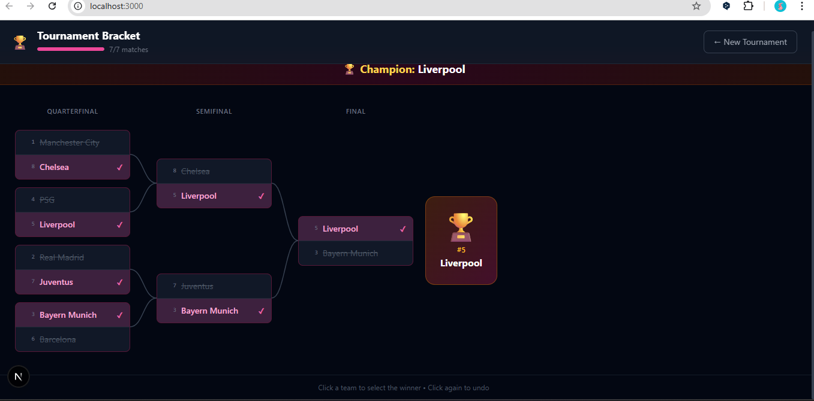
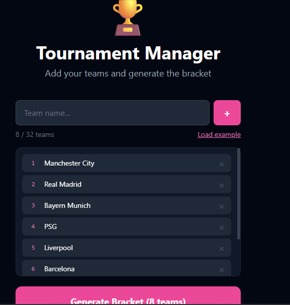
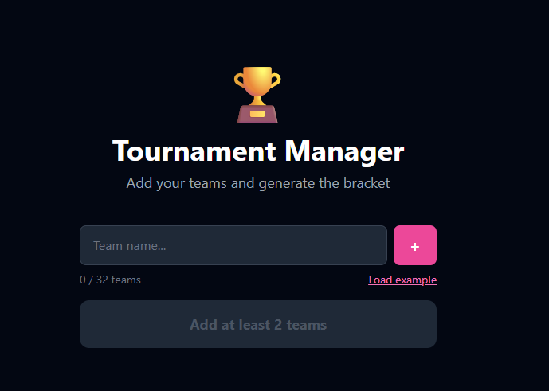

# 🏆 Tournament Bracket Manager

> A sleek, fully interactive single-elimination tournament bracket generator built with **Next.js 14** and **React 18** — featuring smart seeding, automatic bye-handling, cascading winner propagation, and a polished dark UI.

---

## ✨ Features

- **Dynamic bracket generation** — input any number of teams (2–32) and instantly get a properly structured single-elimination bracket
- **Smart seeding** — teams are distributed using a standard tournament seed algorithm (e.g. `[1, 8, 4, 5, 2, 7, 3, 6]`), ensuring top seeds don't meet until the later rounds
- **Automatic bye handling** — when the number of teams isn't a power of two, byes are inserted and automatically advanced in Round 1
- **Click-to-select winners** — click any team to advance them to the next round; click again to toggle (deselect) the result
- **Cascading reset** — changing a result in an early round automatically clears all downstream results that depended on it
- **Champion detection** — once the final match is decided, a champion banner and trophy card appear
- **Progress tracking** — a live progress bar in the header shows how many matches have been completed
- **Responsive bracket canvas** — horizontally scrollable bracket with SVG Bézier connectors between rounds
- **Example teams** — a one-click "Load example" button pre-fills 8 Ukrainian football clubs for quick testing
- **Fully Ukrainian UI** — all labels, round names (Раунд, Чвертьфінал, Півфінал, Фінал), and messages are in Ukrainian

---

## 🛠 Tech Stack

| Technology | Role |
|---|---|
| **Next.js 14** (App Router) | Framework, routing, server-side metadata, client boundary management |
| **React 18** | UI rendering, state management, interactivity |
| **Tailwind CSS v3** | Utility-first styling, dark theme |
| **Vanilla JS classes** | Business logic models (`Team`, `Match`) |

---

## ⚛️ Where React Is Used

This project makes extensive use of React's modern API throughout every layer of the UI:

### `useState`
Used across `page.jsx` and `TeamInput.jsx` to manage:
- Current view (`"input"` vs `"bracket"`)
- The full bracket state — an array of rounds, each containing an array of match data objects
- The team name list during input
- Inline validation error messages
- The controlled text input value

### `useCallback`
All event handlers in `page.jsx` are memoized with `useCallback` to prevent unnecessary re-renders of child components:
- `handleGenerate` — creates `Team` objects and calls `generateBracket()`
- `handleSelectWinner` — updates the bracket state immutably, cascades resets, and advances winners
- `handleReset` — clears the bracket and returns to the input view

### Immutable state updates
Inside `handleSelectWinner`, the bracket state is updated by deep-copying the entire rounds array (`prev.map(round => round.map(m => ({ ...m })))`), then modifying only the affected match objects — a React best practice for complex nested state.

### Component composition
The UI is broken into focused, single-responsibility components:
- `<TeamInput>` — the team entry screen with validation
- `<BracketView>` — the bracket canvas, header, champion banner, and footer
- `<MatchCard>` — a single match card with two `<TeamSlot>` buttons
- `<BracketConnector>` — an inline SVG component for drawing round connectors

### `useRef`
Used in `TeamInput.jsx` to hold a reference to the text input, so focus is automatically returned to it after adding a team — a small but polished UX touch.

### Derived state
The champion is computed inline on every render (no extra `useEffect` needed) by reading the final round's final match's `winnerId` — keeping state minimal and logic simple.

---

## 📐 Where Next.js Is Used

This project uses the **Next.js 14 App Router**:

- **`app/layout.jsx`** — the root layout that sets the HTML `lang`, body styles, and page `<metadata>` (title + description) via Next.js's built-in metadata API
- **`"use client"` directive** — all interactive components (`page.jsx`, `TeamInput.jsx`, `BracketView.jsx`, `MatchCard.jsx`) are explicitly marked as Client Components, since they rely on browser APIs and React state
- **`globals.css`** with Tailwind** — imported once in the root layout and applied globally, following Next.js App Router conventions
- **File-based routing** — the bracket app lives at the root route (`app/page.jsx`)
- **Path aliases (`@/`)** — all imports use the `@/` alias (e.g. `@/components/BracketView`, `@/lib/bracketGenerator`, `@/models/Team`), configured by Next.js automatically

---

## 🧱 Project Structure

```
app/
├── layout.jsx              # Root layout — metadata, global CSS, HTML shell
├── page.jsx                # Main page — bracket state, winner logic, view routing
└── globals.css             # Tailwind base + custom scrollbar styles

components/
├── BracketView.jsx         # Full bracket canvas, header, progress bar, champion banner
├── MatchCard.jsx           # Individual match card with two clickable team slots
└── TeamInput.jsx           # Team entry form with validation and example loader

lib/
└── bracketGenerator.js     # Pure functions: generateBracket(), getRoundName(), nextPowerOfTwo()

models/
├── Match.js                # Match class — status logic, bye detection, slot calculation
└── Team.js                 # Team class — factory method, display helpers
```

---

## 🧠 Architecture & OOP

The project cleanly separates **business logic** from **UI**:

### `Team` class (`models/Team.js`)
Represents a tournament participant. Handles:
- Unique ID generation (`team_<timestamp>_<random>`)
- Seed-based display formatting
- A static factory `Team.createTeams(names[])` that converts a plain name array into seeded team data objects
- Serialization (`toData()` / `fromData()`) for safe storage in React state

### `Match` class (`models/Match.js`)
Represents a single matchup. Provides:
- Computed `status` property: `upcoming`, `bye`, `ready`, or `completed`
- `isBye()` — detects one-sided matches
- `getWinner()` — resolves the winner object from `winnerId`
- Static `getSlot(position)` — determines whether a winner should fill `teamA` or `teamB` in the next round (even position → `teamA`, odd → `teamB`)
- Full serialization support

### `bracketGenerator.js` (`lib/`)
Pure functional utilities:
- `nextPowerOfTwo(n)` — finds the smallest power of two ≥ n (e.g. 6 → 8)
- `getSeededOrder(numSlots)` — recursively builds the standard bracket seeding order
- `generateBracket(teams)` — assembles all rounds, seeds teams into slots, auto-advances byes
- `getRoundName(roundIndex, totalRounds)` — returns `"Фінал"`, `"Півфінал"`, `"Чвертьфінал"`, or `"Раунд N"`

---

## 🚀 Getting Started

```bash
# Install dependencies
npm install

# Run development server
npm run dev

# Build for production
npm run build
npm start
```

Open [http://localhost:3000](http://localhost:3000) to view the app.

---

## 🎮 How to Use

1. **Enter team names** one by one (press Enter or click `+`), or click **"Load example"** to load 8 sample teams
2. Click **"Generate bracket"** to generate the bracket
3. **Click a team name** in any match to select them as the winner — they'll automatically advance to the next round
4. **Click the same team again** to deselect (the result and all downstream results will be cleared)
5. Once all matches are decided, the **🏆 Champion** is revealed
6. Click **"← New Tournament"** to start over

---

## 📸 UI Overview




---

## 📄 License

MIT — free to use, modify, and distribute.
